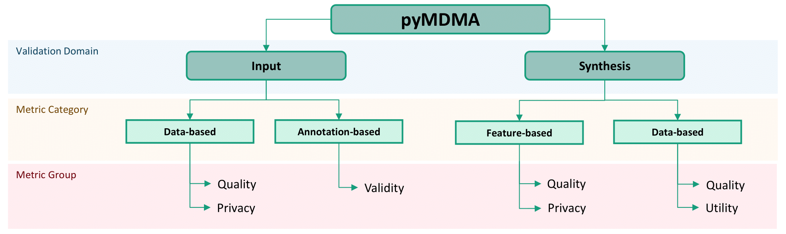

# pyMDMA - Multimodal Data Metrics for Auditing real and synthetic datasets

Data auditing is essential for ensuring the reliability of machine learning models by maintaining the integrity of the datasets upon which these models rely. This work introduces a dedicated repository for data auditing, presenting a comprehensive suite of metrics designed for evaluating data.

pyMDMA is an open-source Python library that offers metrics for evaluating both
real and synthetic datasets across image, tabular, and time-series data modalities. It was
developed to address gaps in existing evaluation frameworks that either lack metrics for
specific data modalities or do not include certain state-of-the-art metrics. The library is designed to be modular, allowing users to easily extend it with new metrics.

The source code is available on [GitHub](https://github.com/fraunhoferportugal/pymdma/tree/main).

## Metric Categories
Each metric class is organized based on the modality, validation type, metric group and goal. Following is a brief description of these categories:

### Validation Type
The platform offers two types of evaluation - input and synthesis validation. The first type includes metrics for assessing raw data quality intended for use in machine learning tasks. The second type evaluates data generated by a synthesis model. Note that input metrics can also be used to evaluate the quality of synthetic datasets.

### Metric Group
Metrics are loosely organized based on the data format and metric input requirements. Data-based metrics require minimal to no preprocessing of the data before computation. Feature-based metrics are computed over embeddings of the data, often obtained with a classification model. Annotation-based metrics validate the integrity and validity of dataset annotations. Currently, this last type is only available for COCO [1] annotated image datasets.

### Metric Goal
These categories represent the types of evaluations each metric performs and are applicable across various validation contexts. For input validation, Quality refers to measurable data attributes, such as contrast and brightness in images or the signal-to-noise ratio in time-series data. In synthesis validation, Quality encompasses three key evaluation pillars for synthetic datasets: Fidelity, Diversity, and Authenticity [2]. Fidelity measures the similarity of a synthetic dataset to real data; Diversity evaluates how well the synthetic dataset spans the full range of the real data manifold; and Authenticity ensures the synthetic dataset is sufficiently distinct from real data to avoid being a copy.

Utility metrics assess the usefulness of synthetic datasets for downstream tasks, which is especially valuable when synthetic data is used to augment real datasets. Privacy metrics examine whether a dataset or instance is overly similar to another; without a reference, they help identify sensitive attributes like names or addresses. Finally, Validity includes metrics that confirm data integrity, such as ensuring that COCO annotations meet standard formatting requirements.

## References
[1] Lin, T. Y., Maire, M., Belongie, S., Hays, J., Perona, P., Ramanan, D., ... & Zitnick, C. L. (2014). Microsoft coco: Common objects in context. In Computer Vision–ECCV 2014: 13th European Conference, Zurich, Switzerland, September 6-12, 2014, Proceedings, Part V 13 (pp. 740-755). Springer International Publishing.

[2] Alaa, A., Van Breugel, B., Saveliev, E.S. &amp; van der Schaar, M.. (2022). How Faithful is your Synthetic Data? Sample-level Metrics for Evaluating and Auditing Generative Models. <i>Proceedings of the 39th International Conference on Machine Learning</i>, in <i>Proceedings of Machine Learning Research</i> 162:290-306 Available from https://proceedings.mlr.press/v162/alaa22a.html.
